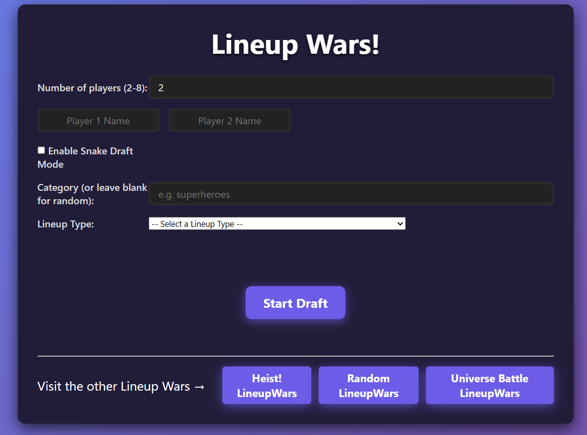

# 🌐 Kellen Ceriani — Interactive Portfolio
<p align="center">
  <a href="https://kellenceriani.github.io">
    
  </a>
  
  
  
</p>
> Personal developer portfolio built with vanilla HTML, CSS, and JavaScript.
> Showcasing web projects, game work, design, music, and interactive experiments.

---

## 🚀 Live Site

**🔗 Portfolio:**
[https://kellenceriani.github.io](https://kellenceriani.github.io)

*(Automatically deployed via GitHub Pages)*

---

## 📸 Preview



---

## 🧭 Overview

This repository contains the source code for my personal portfolio website.
It functions as a central hub for my work across:

* Web development
* Game development
* Interactive media
* Animation
* Music composition
* UI/UX design

The site is designed to be:

* Lightweight
* Fast
* Fully custom
* Framework-free
* Easy to iterate
* Highly interactive

It also includes an archived version of my previous portfolio for historical reference.

---

## ✨ Key Features

### 🎨 Interactive UI

* Custom scrolling behavior
* Modal-based project viewing
* Animated sections
* Smooth transitions
* Audio integration

### 🧩 Modular JavaScript

* Project rendering system
* Modal manager
* Custom scroll handler
* Reusable UI logic

### 📁 Portfolio Content

* Web projects
* Games
* Creative coding
* Music
* Resume
* Legacy portfolio archive

### 🗂 Version history included

The repo contains:

* Current portfolio (active)
* Old portfolio (archived but preserved)

---

## 🏗 Tech Stack

**Core**

* HTML5
* CSS3
* Vanilla JavaScript

**Design**

* Custom CSS architecture
* Component-based styling
* Layout + animation separation

**Media**

* Audio integration
* GIF animations
* PDF resume embedding

**Hosting**

* GitHub Pages

---

## 📂 Project Structure

```
.
├── index.html
├── README.md
│
├── css/
│   ├── base.css
│   ├── layout.css
│   ├── components.css
│   └── aboutAnim.css
│
├── JS/
│   ├── main.js
│   ├── projects.js
│   ├── modals.js
│   └── customscroll.js
│
├── imgs/
├── audio/
│
└── OLD_PORTFOLIO/
    ├── index.html
    ├── style.css
    ├── wheel.js
    └── ...
```

---

## 🧠 Architecture Notes

### Layout System

CSS is split into:

| File           | Purpose             |
| -------------- | ------------------- |
| base.css       | resets + typography |
| layout.css     | grid & structure    |
| components.css | reusable UI         |
| aboutAnim.css  | animations          |

This separation keeps styling scalable and maintainable.

---

### JavaScript Modules

**main.js**

* Entry logic
* Event listeners
* Initialization

**projects.js**

* Project data
* Rendering logic
* Dynamic project population

**modals.js**

* Modal window system
* Project detail popups
* Media handling

**customscroll.js**

* Scroll animation behavior
* Section transitions

---

### Design Philosophy

The site intentionally avoids heavy frameworks.

Reasons:

* Full control
* Performance
* Simplicity
* Educational value
* Long-term maintainability

---

## 🕰 Legacy Portfolio

Located in:

```
OLD_PORTFOLIO/
```

Contains:

* Previous design iterations
* Archived projects
* Older UI experiments
* Audio and animation work

This is preserved for:

* Historical reference
* Evolution tracking
* Nostalgia 🙂

---

## 🧪 Local Development

Clone the repo:

```bash
git clone https://github.com/kellenceriani/kellenceriani.github.io.git
cd kellenceriani.github.io
```

Run locally:

```bash
open index.html
```

Or use a dev server:

```bash
npx serve .
```

---

## 🚀 Deployment

This site deploys automatically via **GitHub Pages**.

Branch:

```
main
```

URL:

```
https://kellenceriani.github.io
```

No build step required.

---

## 🎯 Future Improvements

* Accessibility improvements
* Mobile UX refinements
* Dark mode
* Project filtering system
* Performance optimization
* Lazy loading assets
* More interactive demos

---

## 📄 Resume

Available in:

```
/imgs/Kellen_Ceriani_Resume.pdf
```

---

## 🛠 Design Goals

* Clean
* Interactive
* Fast
* Memorable
* Personal
* Framework-light
* Recruiter-friendly

---

## 🤝 Contributing

This is a personal portfolio, but feedback is always welcome.

Open an issue for:

* Bugs
* Suggestions
* Improvements
* Accessibility ideas

---

## 📜 License

MIT — feel free to learn from or reference the structure.

---

## 👋 About Me

Developer focused on:

* Interactive web
* Games
* Creative tech
* UI/UX
* Multimedia experiences

This portfolio evolves as I do.

---

## ⭐ If you like this project

Star the repo — it helps more than you think.

---

## 🧩 Maintained by

**Kellen Ceriani**
GitHub: [https://github.com/kellenceriani](https://github.com/kellenceriani)

---
